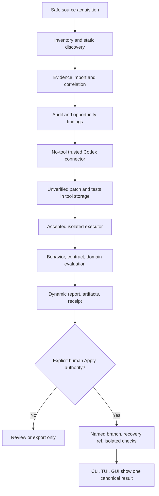

# PROMPTECTOMY stable v1 master execution plan

Date: 19 July 2026
Status: ready for one persistent `/goal` execution
Finish line: security-reviewed, performance-qualified, open-source stable v1 with local CLI, TUI, desktop GUI, dynamic reports, bounded Codex remediation, safe Apply, installers, governance, and verified release artifacts

## Objective

Take PROMPTECTOMY from the winning hackathon prototype and accepted Phase 0 design to a genuinely releasable local-first product. Completion means the documented stable v1 promise is implemented end to end, independently reviewed, tested against supported and hostile corpora, packaged for claimed platforms, open-sourced through an explicit human release gate, and demonstrated from a clean installation without relying on fixture-only or hidden prototype paths.

This is one master execution program. Intermediate phases are milestones, not stopping points. The active `/goal` continues automatically from one phase to the next until every definition-of-done item is proven or a genuinely human-only gate remains.

## Current truth

- Repository: `/Users/zain/Documents/codex-build-hack`.
- Current branch and commit: `main` at `8bab7bba966030e9c84af86352dc4a70e8462d4f`, matching `origin/main` at plan time.
- Phase 0 product, architecture, security, contract, UX, test, and governance decisions are staged but not committed.
- `engine/promptectomy/generated/route_ticket.py` is a pre-existing unstaged user/live-demo change. Its protected SHA-256 is `a4fcdab0f1baef70072620e1409d68e732c5a4549d3f36388a7213237dab961c`.
- Never stage, restore, overwrite, format, regenerate, commit, move, delete, or decide that file's disposition without Zain's explicit instruction. Recheck the digest at every phase boundary.
- The current Python prototype is real but narrow and unsafe for untrusted/production use. It writes inside target repositories, launches Codex with workspace write access, and imports generated Python into the parent process.
- The current Next.js public site is a recorded replay. It is not a hosted repository runner.
- There is no Rust workspace, durable SQLite control plane, accepted executor, full TUI, Tauri GUI, safe general Apply, complete Python/TypeScript adapter matrix, cross-platform CI, or open-source release infrastructure.
- The repository is private. Apache-2.0, DCO, the product name, package namespaces, signing identities, repository publicity, and production/publication actions remain human gates.

## Authoritative inputs

Read before implementation, in this order:

1. `AGENTS.md`
2. `.agent/state/STATUS_2026-07-18.md`
3. `.agent/state/FORWARD_PLAN_2026-07-18.md`
4. `docs/architecture/phase-0-review-resolution.md`
5. `docs/product/vision-and-scope.md`
6. `docs/adr/0001-authority-and-non-mutation.md` through `0008-open-source-governance.md`
7. `docs/architecture/system-design.md`
8. `docs/architecture/adapters-and-support.md`
9. `docs/architecture/privacy-and-data-egress.md`
10. `docs/architecture/threat-model.md`
11. `docs/architecture/contracts-v2.md`
12. `docs/architecture/testing-and-benchmarks.md`
13. `docs/architecture/ux-contracts.md`
14. `docs/architecture/phase-1a-handoff.md`
15. Current source, locks, tests, CI, Git state, and latest phase receipts

The accepted tracked design is the target contract. Current source is migration input, not authority where it conflicts with Phase 0.

## Stable v1 finish line

### Product capability

- Import a local checkout, explicit HTTPS/SSH Git repository through the safe acquisition boundary, archive, or evidence bundle.
- Inventory any input at L0 and explicitly report supported, experimental, ambiguous, and unsupported areas.
- Provide stable L1-L4 support for Python and TypeScript/JavaScript OpenAI Responses callsites across sync, async, streaming, structured output, tools, retries, errors, and cancellation.
- Ingest or capture versioned metadata-only evidence through OTLP/OpenInference-compatible adapters, with protected content opt-in only.
- Run Inspect and Audit without changing or executing the target repository.
- Generate bounded Codex candidate patches in tool-owned storage through the trusted connector.
- Execute generated/repository/test code only through an accepted isolated executor, never in the core or clients.
- Evaluate candidates against behavior, contracts/invariants, domain evidence, grouped/temporal holdouts, and declared thresholds.
- Produce dynamic and frozen reports, patch/tests, evidence limitations, safe artifacts, and digest-bound receipts.
- Offer explicit branch-based Apply with fresh digest checks, preview, recovery reference, approved isolated checks, and no default-branch write.
- Expose one authoritative local system through CLI, Ratatui TUI, and Tauri/React GUI, with client/report parity.
- Show a bounded agent office with role, scope, tools, network/environment status, budgets, attempts, safe activity, artifacts, and cancellation. Agents never grant authority or access hidden holdouts.

### Release capability

- Clean install, upgrade, export, and uninstall on every claimed platform.
- Reproducible/versioned contracts and generated Rust/Python/TypeScript bindings.
- CI for formatting, linting, units, properties, fuzz smoke, contracts, adapters, executors, clients, hostile fixtures, installers, secrets, licenses, SBOM, provenance, and release verification.
- Honest README and documentation executed verbatim against released artifacts.
- Governance, contribution, security disclosure, support/compatibility, changelog, roadmap, architecture, threat, privacy, and release policies.
- Human-approved license/name/publication, signed/checksummed artifacts where identities exist, SBOM, provenance/attestations, and a verified public repository/release.

## Explicit non-goals for stable v1

- Multi-tenant hosted execution or a cloud service that receives private repositories.
- Automatic production deployment, default-branch mutation, or self-authorized Apply/Integrate.
- A claim that every language or repository reaches L1-L4.
- Runtime hot-swap as the default remediation path.
- Identity-signed evaluation receipts without a separately accepted signer/key lifecycle.
- Universal WASM/container support or weakening isolation for hosts without an accepted backend.
- Kafka, Kubernetes, a network database, or other distributed infrastructure for a single-user local product.

These are not forgotten. They require separate post-v1 designs and authority grants rather than being smuggled into the trusted v1 core.

## Non-negotiable invariants

1. Inspect, Audit, and Draft preserve target files, index, refs, config, hooks, worktrees, nested repositories, and untracked inventory across success, failure, cancellation, crash, and unsupported outcomes.
2. Draft storage is private tool-owned storage outside the target and its `.git` directory.
3. Repository, generated, candidate, test, dependency, and build code never runs in the trusted core, daemon, CLI, TUI, GUI, or report renderer.
4. Verified Draft fails closed without every accepted executor control. There is no host or weaker-backend fallback.
5. Model credentials remain in the trusted connector. Git credentials remain in the acquisition broker. Neither enters agent tools, executors, reports, events, or artifacts.
6. Data transmission requires an exact manifest and authority. Metadata-only is default; local-only mode never transmits.
7. Unsupported, ambiguous, insufficient, zero-work, cancelled, interrupted, and failed states are typed and visible. Activity is not success.
8. Candidate bytes are data until isolated evaluation. Evaluation failure is not candidate success or failure.
9. Apply is a separate explicit action, never implicit after Draft/evaluation, never to the default branch in v1, and never forceful.
10. Safe events/reports contain no raw secrets, protected bodies, arbitrary exceptions, or untrusted terminal/browser control content.
11. Receipts are digest-bound consistency evidence. They are not called signed identity attestations.
12. Client convenience cannot widen core authority or invent state unavailable through the canonical contract.

## Execution protocol

### Persistence

- Do not mark the master goal complete at an intermediate phase.
- Maintain one current `.agent/state/STATUS_<date>.md`, one phase ledger, and evidence under `.agent/logs/` or tracked `docs/` as appropriate.
- At every phase entry, verify branch, HEAD/upstream, index/worktree, route-ticket digest, dependency locks, current test baseline, and inherited versus newly verified claims.
- At every phase exit, update status, acceptance evidence, known debt, rollback, and the next phase entry instructions, then continue.
- Use focused commits with no co-author tag after a phase's review gates pass. Push safe branches regularly. Never absorb unrelated user work.
- If context compacts, resume from the phase ledger and receipts. Do not restart completed phases or trust chat summaries over files/Git.

### Engineering method

- Use `uv` for Python, Bun for existing web/TS, and Rust for the trusted control plane/performance-critical paths. Respect every existing lockfile and never mix package managers.
- Implement the smallest accepted slice, add the mapped tests, run targeted checks, self-review, independent diff review, and security review for sensitive surfaces.
- Use synthetic/hermetic repositories, traces, endpoints, credentials, and malicious fixtures. Never test on an unrelated real repository or customer data.
- Use primary sources for current APIs/libraries/security behavior. Pin versions and record source/version assumptions.
- Do not paper over failures with retries, mocks presented as E2E, relaxed assertions, skipped hostile cases, or marketing caveats.
- Every external action, subprocess, executor, and agent call has a bounded timeout, cancellation path, resource/output caps, and typed failure.
- Treat performance budgets as gates after measurement, not optimistic claims.

### Review and escalation

- Every phase receives a fresh architecture/diff review. Security-sensitive phases receive a fresh security review.
- Resolve every P0/P1 before continuing. Record accepted P2/P3 with owner and due phase. A release cannot carry a relevant critical/high finding.
- Use cross-model review for architecture and final visual design. Codex owns functional frontend wiring; final GUI visual polish goes through the designated Claude design lead and returns for functional/security verification.
- When genuinely blocked on an account, signing identity, legal choice, secret, paid resource, physical device, or publication decision: record the exact blocker, ping Zain once, build every independent path/stub/fixture around it, and continue other phases. Never silently stop.
- Human approval cannot be replaced by an agent assumption. The master goal stays active until the gate is resolved or the user explicitly narrows the finish line.

## Target execution flow

## Success criteria

### Authority and security

- Every authority invariant and mapped threat test passes on success, failure, cancel, crash, dirty, unsupported, and malicious cases.
- Zero target mutation occurs before explicit Apply.
- Zero untrusted parent/client execution and zero privacy/credential canary leaks occur.
- Accepted executor tests prove filesystem, environment, credential, network, device/socket, privilege, process, resource, output, timeout, cancellation, and cleanup boundaries.
- Safe Git acquisition proves protocol/config/helper/redirect/submodule/LFS/filter/hook/path/quota behavior.
- Apply refuses stale, dirty/default-branch, out-of-scope, tampered, conflicting, or unrecoverable inputs.

### Correctness and compatibility

- Contract schemas and generated bindings validate/regenerate cleanly in Rust, Python, and TypeScript.
- Run/event/state/idempotency/cursor/recovery/migration/receipt/artifact semantics pass property, crash, corruption, and compatibility tests.
- Python and TypeScript OpenAI Responses feature matrices pass the declared stable cells and expose all unsupported gaps.
- Behavioral, contract, and domain evaluation distinctions are visible and receipt-bound.
- CLI/TUI/GUI and JSON/Markdown/HTML/NDJSON/SARIF/JUnit projections agree for frozen runs.

### Reliability and performance

- All started runs reach or recover to one coherent terminal state, with no orphan workers.
- Cancellation, recovery, event latency, inventory, report, storage, and memory budgets in `testing-and-benchmarks.md` are measured and met or revised only through reviewed evidence.
- Large repositories/events stream within bounded memory, use backpressure/pagination, and never hide quota failure.
- Install, upgrade, rollback/export, and uninstall work from clean environments on claimed platforms.

### UX and release

- CLI quickstart, full keyboard/plain TUI, and keyboard/screen-reader-capable GUI cover import, preflight, run, findings, candidate, agent office, report/export, cancel/recovery, storage/privacy, and Apply.
- Final GUI visual polish has design-lead review without changing authority semantics.
- README and demo use a real dynamic local run. Any replay is labelled fixture.
- Public release contains honest support limits, governance/security docs, license approval, changelog, SBOM, checksums, provenance, signatures where claimed, installers/packages, and reproducible verification instructions.
- Fresh-user and independent security acceptance are recorded before stable release.

## Phase 0T: transition safely into execution

### Goal

Create a recoverable implementation branch and commit the accepted planning foundation without touching the protected user diff.

### Tasks

1. Re-read the authoritative inputs and inspect the current staged/unstaged state.
2. Verify the route-ticket digest and ensure it is absent from the index.
3. Add this master plan and `goal.txt` to the planning set. Create `zc/product-v1` unless a stronger existing branch/worktree convention is discovered.
4. Commit only Phase 0/master-plan documentation with a concise message. Do not commit or restore `route_ticket.py`.
5. Push the implementation branch, verify the remote commit, and record the exact baseline.
6. Create the master phase ledger and update authoritative status to Phase 1A in progress.
7. Inventory product tests/builds in a clean read-only baseline run. Record failures as inherited; do not fix unrelated failures in transition.

### Exit criterion

The implementation branch contains the reviewed plan/docs, the protected file is unchanged and unstaged, baseline checks are recorded, and Phase 1A can begin without ambiguous index state.

### Rollback

Return to the documented baseline branch/commit without touching the protected working-tree file.

## Phase 1A: honest non-mutating Python reference

### Goal

Implement the bounded behavior in `docs/architecture/phase-1a-handoff.md` so Python becomes the conformance oracle for safe modes and unverified patches.

### Tasks

1. Add explicit `doctor`, `inspect`, `audit`, `draft`, `status`, and JSON/Markdown report semantics.
2. Introduce the minimum mode, authority, terminal-status, typed-error, support, artifact, receipt, and safe-event models.
3. Separate source inspection from acquisition, synthesis, execution, and target output paths.
4. Prove no target/Git mutation across clean, dirty, failure, cancellation, unsupported, symlink, nested-repo, and prompt-injection fixtures.
5. Remove all general-path repository imports/commands/dependency execution/generated execution.
6. Implement direct OpenAI Responses calls to an API-available Codex coding model with strict output schema, no tools, manifest-minimized context, explicit budget, and fail-closed `safe_agent_transport_unavailable`.
7. Parse candidate patch/tests as untrusted data, validate every path/base digest, and persist only in private tool-owned content-addressed storage.
8. Persist safe append-only events, terminal state, limitations, support/unsupported accounting, retention/cleanup state, and digest-bound receipts.
9. Quarantine the legacy synthetic demo path so no general command reaches unsafe synthesis/replay or reports false success.
10. Build/install a clean wheel and prove packaged assets load outside the checkout.

### Verification

Run the Phase 1A subset from `testing-and-benchmarks.md`, including `INV-AUTH`, `INV-NM`, `PARENT`, `CONNECTOR`, applicable `PATH`, `PRIV`, CLI/report, installed-wheel, and zero-work regressions. Use injected HTTP/client doubles; a live synthetic model probe requires explicit egress/spend approval.

### Exit criterion

Inspect/Audit/Draft-unverified are demonstrably non-mutating and non-executing; safe artifacts/reports are real; unsupported/failure is typed; installed wheel and privacy gates pass; reviewers report no P0/P1.

### Rollback

General commands remain typed unsupported rather than falling back to the hackathon execution path.

## Phase 1B: accepted isolated executor

### Goal

Make verified execution possible without trusting repository/generated code or weakening hosts that lack isolation.

### Tasks

1. Define and implement the executor protocol/manifest independently of any one backend.
2. Implement an accepted local OCI backend, preferring OrbStack-compatible runtime behavior on macOS while supporting declared Linux/Windows runtime matrices.
3. Enforce non-root, read-only source/root filesystem, private scratch, empty environment plus allowlist, no host/runtime sockets, no privilege escalation, dropped capabilities, device/seccomp policy, offline execution, and digest-pinned runtime/toolchain inputs.
4. Enforce CPU, memory, PID, file, disk, wall-time, output, process-tree, and artifact bounds with reliable cancellation/cleanup.
5. Separate explicit networked dependency acquisition from offline evaluation. Respect locks, registries, integrity, package manager, scripts, and budgets.
6. Add optional Wasmtime/WASI only for compatible pure workloads with explicit preopens/capabilities. Never use it as a universal fallback.
7. Keep model transport and Git credentials outside executor environments.
8. Return typed unsupported when a requested control cannot be enforced.

### Verification

Run `EXEC`, `POLICY`, `CRED`, `CANCEL`, path/artifact, fork-bomb, socket/device, env/secret, DNS/network, resource flood, output flood, crash, and orphan-worker tests on each claimed backend/platform.

### Exit criterion

Every accepted executor invariant is independently demonstrated; verified Draft cannot run through any weaker path; no P0/P1 remains.

### Rollback

Disable the affected backend/support cell. Audit and unverified Draft remain available.

## Phase 1C: hostile clean-install acceptance

### Goal

Prove the packaged product remains safe outside the source checkout against malicious repositories and evidence.

### Tasks

1. Build wheel/application artifacts in clean environments from locked inputs.
2. Install them into disposable users/directories without repository-relative assets.
3. Run synthetic supported, unsupported, dirty, monorepo, path, archive, Git, prompt-injection, privacy, terminal, report, and malicious executor corpora.
4. Prove install/uninstall leaves no undeclared files/processes/state.
5. Verify default config is metadata-only, analytics-off, local-only-capable, and fail-closed.
6. Record exact package contents, dependency licenses, hashes, toolchains, and reproducible commands.

### Exit criterion

The installed artifact passes all Phase 1A/1B authority, privacy, hostile, cancellation, cleanup, and packaging gates independently of the source tree.

## Phase 2: Contract v2, durable state, artifacts, API, and reports

### Goal

Replace prototype JSON coordination with the canonical durable model that every client and future Rust core can share.

### Tasks

1. Create tracked `schemas/v2` Draft 2020-12 entities/events/API/examples and pinned reproducible Rust/Python/TypeScript bindings.
2. Enforce strict fields, safe/protected separation, UUIDv7/digest/path types, JCS/SHA-256 receipts, version negotiation, and previous-minor/unknown-major fixtures.
3. Implement SQLite event/projection state using a patched supported SQLite, one orchestrator writer, WAL/version gate, atomic event+projection transactions, leases, crash recovery, backup/restore, forward migrations, checkpoints, and concurrency rules.
4. Implement content-addressed artifact storage with atomic writes, class non-downgrade, protected envelope metadata, quarantine, pins, references, retention, deletion, and GC.
5. Implement Unix-domain socket/Windows named-pipe local API; allow loopback fallback only with capability token, strict Host/Origin/CORS, permissions, bounds, idempotency, and lifecycle controls.
6. Implement frozen canonical JSON plus Markdown, sanitized offline HTML, NDJSON, SARIF, JUnit, patch, and receipt exports.
7. Migrate/import legacy prototype events as explicitly legacy/import-only data without making them Contract v2 authority.
8. Prove CLI/report/API parity and deterministic digests.

### Verification

Run all `CONTRACT`, `COMPAT`, `STATE`, `MIG`, `ART`, `RECEIPT`, `API`, `CLI`, `REPORT`, backup, corruption, disk-full, gap/dedup, and crash tests.

### Exit criterion

One real fixture run survives restart and produces equivalent safe projections and verified artifacts/receipts through every implemented format.

### Rollback

Restore verified backup/export, keep older formats import-only, and disable incompatible adapters rather than migrating backward silently.

## Phase 3: Rust control plane and canonical CLI

### Goal

Move the trusted orchestration, policy, state, acquisition, artifact, API, and CLI boundaries into a small auditable Rust core without a big-bang rewrite.

### Tasks

1. Create a Rust workspace only now, with minimal crates for domain/contracts, policy/authority, state/artifacts, acquisition, executor protocol, agent connector protocol, local API, CLI, and test fixtures.
2. Keep Python/TypeScript adapters out of process behind versioned size-bounded protocols.
3. Implement orchestration/state transitions, cancellation, cleanup, budgets, safe errors, and receipt checks in Rust.
4. Implement the canonical CLI surface, JSON output, exit codes, plain/no-color mode, safe terminal rendering, and watch/reconnect.
5. Run Python and Rust implementations against shared conformance fixtures until the Rust path matches the accepted oracle.
6. Migrate users/state with backup and import compatibility; retain a documented rollback version.
7. Establish macOS/Linux/Windows CI for the Rust core and protocol clients.

### Verification

Cross-language contract regeneration, oracle differential tests, property/fuzz tests, cancellation/crash recovery, platform path/process/IPC tests, and benchmarks.

### Exit criterion

Rust is authoritative for trusted local control/CLI, adapters remain isolated, state/report behavior matches contracts, and claimed platforms pass CI with no P0/P1.

## Phase 4: safe acquisition, stable adapters, capture, and evidence

### Goal

Make local and remote repositories plus real evidence usable without overclaiming support or leaking protected content.

### Tasks

1. Implement the full ADR 0004 local, HTTPS, SSH-brokered, archive, and bundle acquisition policies.
2. Neutralize inherited Git config/helpers/hooks/filters/LFS/submodules/protocols; use no-checkout inventory, immutable commits, redacted locators, quotas, path validation, and receipts.
3. Implement deterministic Python and TypeScript/JavaScript OpenAI Responses discovery with pinned Tree-sitter/ast-grep rules and optional SCIP where justified.
4. Cover sync, async, streaming, structured output, tools, retries, errors, cancellation, aliases, declared wrappers, and explicit dynamic ambiguity.
5. Implement metadata-only Python/Node capture and OTLP HTTP/gRPC/OpenInference import with duplicate/out-of-order/partial/malformed handling, backpressure, and versioned mappings.
6. Correlate evidence to callsites with explicit confidence/reason; never silently upgrade correlation.
7. Implement source/context minimization, secret scans, protected content opt-in, encryption/key-store gates, retention/deletion, local-only, and exact egress previews.
8. Publish the machine-readable stable/experimental/unsupported matrix from conformance evidence.

### Verification

Run `GIT`, `PRIV-GIT`, `PATH`, `ARCH`, `DISC`, `CAP`, `OTLP`, `PRIV`, `EGRESS`, `BACKUP`, credential, mixed-monorepo, and all stable feature-cell tests.

### Exit criterion

Local/public/private-brokered inputs and evidence work within declared boundaries; Python/TS stable cells pass; unsupported gaps remain visible; zero canary leaks and no P0/P1.

## Phase 5: isolated Codex synthesis and rigorous evaluation

### Goal

Turn findings into genuinely reviewable L4 candidates rather than model-agreement demos.

### Tasks

1. Implement the provider-neutral AgentRuntime with Codex first, strict typed roles, prompt registry, model compatibility, budgets, attempts, cancellation, and safe activity.
2. Keep Phase 1A no-tool connector for narrow proposal tasks. Admit agentic Codex SDK/CLI surfaces only inside accepted tool/executor boundaries with no connector credential in tools.
3. Validate every agent path, symbol, dependency, command, patch, and output against snapshot/authority schemas.
4. Build grouped/near-duplicate, deterministic, temporal where relevant, train/dev/hidden-holdout splits with leakage tests and parent-owned irreversibility.
5. Execute candidates through accepted executors only.
6. Evaluate behavior, schemas/contracts/security/business invariants, repository tests where authorized, domain truth, rare/high-impact cases, performance, cost, and maintenance constraints.
7. Distinguish candidate failure, evaluator failure, insufficient evidence, exploratory, reviewable, and strong grades.
8. Bind snapshot, authority, prompts/models, evidence/splits, executor/toolchain/dependencies, patch/tests, results, limitations, and artifacts into receipts.
9. Support multiple bounded candidates/comparisons without unbounded self-repair loops.

### Verification

Run `AGENT`, `CONNECTOR`, `HOLD`, `EVAL`, `EXEC`, `CRED`, `CANCEL`, injection, hallucinated path, hidden-holdout, baseline-wrong, evaluator-failure, and Python/TS L4 corpus tests.

### Exit criterion

Both stable languages produce independently reviewable isolated candidates on accepted fixtures; freeform/unsupported cases are kept honestly; receipts verify; no P0/P1.

## Phase 6: full Ratatui TUI

### Goal

Provide a first-class keyboard/SSH client over the canonical local API, not terminal decoration around fixture events.

### Tasks

1. Implement repository/run picker, preflight, authority/egress, stages, inventory, findings, evidence, candidates, diffs/tests, agent office, receipts, export/delete, storage/settings, and Apply entry.
2. Implement search/filter, visible shortcuts/help, predictable focus, narrow/resize handling, pagination/virtualization, reconnect/gap behavior, cancellation state, and plain mode.
3. Escape ANSI/OSC/hyperlink/bidi/Unicode and pathological untrusted content.
4. Ensure color is never the only signal and all decision data exists in plain/JSON forms.
5. Prove no TUI-only orchestration or authority.

### Verification

Run `TUI`, `TUI-SEC`, PTY, tmux/SSH, resize, reconnect, event-gap, untrusted terminal, keyboard, plain-mode, and parity tests.

### Exit criterion

The TUI completes the supported workflow and matches canonical state/reports under automated and manual terminal acceptance.

## Phase 7: Tauri desktop GUI and final design

### Goal

Deliver a secure, accessible, polished desktop client that drives the real local engine and dynamic reports.

### Tasks

1. Implement the functional React/Tauri scaffold for Home, Import, Preflight, Run, Inventory, Finding, Candidate, Agent Office, Apply, History, Privacy/Storage, and Settings.
2. Connect only through the canonical local API with explicit minimal Tauri capabilities, bundled local origins, safe external links, and no arbitrary shell/filesystem/native bridge.
3. Implement reconnect, event-gap recovery, cancellation, cleanup, loading/empty/unsupported/error, large-list/diff virtualization, offline report, and fixture-label behavior.
4. Meet keyboard, semantic structure, focus restoration, announcements, contrast, zoom/reflow, reduced motion, and screen-reader requirements.
5. Hand the working wired scaffold and design constraints to the designated Claude design lead for coherent visual language and production polish.
6. Bring the polished result back through Codex functional, accessibility, performance, Tauri-security, and E2E review. Visual work cannot alter authority semantics.
7. Replace the public hackathon presentation with an honest release site/demo that clearly separates downloadable/local product from any recorded fixture.

### Verification

Run `GUI`, API/Tauri capability/origin/window, Playwright/WebDriver, accessibility, keyboard, screen-reader, reconnect/cancel, untrusted HTML/Markdown/SVG/URL, performance, and client-parity tests.

### Exit criterion

The installed desktop GUI completes the real workflow against the local core, passes security/accessibility/E2E gates, and has design-lead approval plus functional re-verification.

## Phase 8: bounded agent office, safe Apply, and local integrations

### Goal

Complete the controlled remediation loop from reviewed candidate to recoverable branch change and optional installed integration.

### Tasks

1. Expose structured agent roles/goals/scopes/tools/network/environment/budgets/attempts/activity/artifacts/cancel across all clients.
2. Enforce that agents cannot request wider authority, access holdouts, Apply, Integrate, credentials, or undeclared paths.
3. Implement Apply as a fresh action: resolve target, verify repository/snapshot/receipt/patch, refuse stale/default/dirty by default, show every path/dependency/config/binary/symlink/workflow change, create named non-default branch and recovery reference, apply without force, run approved isolated checks, and record result/divergence.
4. Implement conflict/failure recovery without deleting or overwriting user work.
5. Implement optional local CI export/integration and drift re-evaluation only through separate install/authority flows. No automatic deployment or hidden runtime hot-swap.
6. Make every action available through the same API/CLI and visible in TUI/GUI/history.

### Verification

Run all `AGENT`, `APPLY`, non-mutation, stale/dirty/default/conflict/tamper/recovery, branch, cancellation, integration uninstall, and client-parity tests. Include one successful fixture Apply and all refusal cases.

### Exit criterion

A human can review and safely apply an eligible candidate to a named branch with recovery evidence; all agent/integration authority remains bounded; no P0/P1.

## Phase 9: release candidate hardening and supply chain

### Goal

Turn the feature-complete product into a measurable, supportable release candidate.

### Tasks

1. Run the complete unit/property/fuzz/contract/adapter/repository/executor/agent/evaluation/storage/client/installer/security corpus across claimed platforms.
2. Meet or evidence-review every SLO/benchmark for cancellation, recovery, event latency, inventory scale, report scale, API, memory, storage, and deterministic output.
3. Profile and optimize proven bottlenecks without weakening safety or obscuring failures.
4. Build clean macOS/Linux/Windows artifacts as claimed; verify install, upgrade, export/backup, rollback, uninstall, fresh user, and corrupted/old-state recovery.
5. Pin toolchains/dependencies, run vulnerability/license/secret scans, generate SBOM, checksums, and provenance/attestations; sign/notarize only with approved identities and verifier-tested flows.
6. Complete `LICENSE`/`NOTICE` after approval, `SECURITY.md`, `CONTRIBUTING.md`, DCO/CLA instructions, code of conduct, governance, support/compatibility, changelog, roadmap, architecture/privacy/threat docs, and release playbooks.
7. Run independent architecture, security, privacy, accessibility, release, and fresh-context diff reviews. Resolve P0/P1 and release-blocking support gaps.
8. Execute README quickstart and full real dynamic demo from released artifacts, not the source checkout.

### Exit criterion

The release candidate passes every declared automated/manual gate, has no critical/high or P0/P1 issue, and is ready for only the explicit human publication decisions.

## Phase 10: human release gate, public open source, and post-release verification

### Goal

Publish only the product that was actually accepted, then independently verify the public experience and close the master goal.

### Human decisions required

1. Disposition of the protected `route_ticket.py` working change.
2. Final product name and namespace decision, with legal/trademark caveat or review.
3. License and DCO/CLA adoption.
4. GitHub repository publicity.
5. Package registry, domain, signing/notarization identities, and release channel.
6. Final external-write approval for publication/deployment.

Do not guess these decisions. Request them together with the exact evidence, recommendation, tradeoffs, and reversible fallback. Continue all other preparation while waiting.

### Tasks after approval

1. Resolve the protected working diff exactly as Zain directs and prove the final release tree is clean.
2. Apply approved name/license/governance changes and rerun license, namespace, secret, build, install, and documentation checks.
3. Merge through reviewed history without bypassing protected branches/checks.
4. Make the repository public if approved and verify anonymous clone, files, license, security route, releases, CI, and no private artifacts/secrets/history leaks.
5. Publish approved packages/installers/releases, checksums, SBOM, provenance, signatures, changelog, compatibility/support matrix, and migration/rollback notes.
6. Deploy only approved static/download/demo surfaces. Do not create hosted private-repository execution.
7. From clean anonymous environments, execute README install/quickstart, local and explicit remote fixture import, Audit, Draft/evaluation, TUI, GUI, report/export, cancellation/recovery, safe Apply, upgrade, and uninstall.
8. Run independent post-publication security/secret/license/package verification and verify all public links/artifacts/signatures/provenance.
9. Record release receipts, known non-blocking limitations, support process, advisory procedure, and first maintenance milestone.
10. Update authoritative status to stable released, archive superseded plans, and send the one final completion notification.

### Exit criterion

The approved public release is reproducible, anonymously installable, dynamically demonstrable, supportable, and independently verified. The repository is clean, every claim maps to passing evidence, all human gates are recorded, and no required work or unresolved P0/P1 remains.

## Phase 10X: optional post-v1 lanes, not hidden release blockers

After v1 completion, create separate reviewed goals for any selected lane:

- hosted/multi-tenant execution with a new privacy, identity, tenancy, billing, abuse, incident, and isolation design;
- production shadow/deployment integration with separate rollback/on-call/data policies;
- additional language/provider adapters promoted through the same conformance ladder;
- organization/team service, remote collaboration, or enterprise policy management.

Do not keep the v1 master goal open forever for unselected future products. Stable v1 completion is the explicit finish line above.

## Risks and blockers

| Risk | Required handling |
|---|---|
| Protected user diff is accidentally absorbed | Hash at every boundary; explicit staged-file lists; never broad add/restore; human disposition only in Phase 10 |
| Unsafe prototype path survives behind a convenience command | Quarantine/deprecate, prove reachability tests, fail typed unsupported, no fallback |
| Executor is called a sandbox without enforcement evidence | Backend-specific hostile tests; support cell disabled on any missing control |
| Agent/model obtains repo tools or credentials | Separate connector/broker/executor, canary tests, no-tool Phase 1A, fixed typed roles/budgets |
| “Any repo” claim outruns adapters | L0 for all inputs; L1-L4 only per passing matrix; visible unsupported coverage |
| Contract/code generation drifts | One schema source, pinned regeneration, clean-diff CI, compatibility fixtures |
| Rust migration becomes a rewrite freeze | Python oracle, adapters remain usable, independently shippable phases, rollback version |
| SQLite corruption/version bug/migration failure | Patched version gate, backups, recovery/crash/disk-full tests, export compatibility |
| UI polish invents authority or demo fakery | Canonical API only, replay label, functional re-review after design lead |
| Cross-platform claim relies only on CI | Fresh-user/manual physical records for claimed environments; narrow claims if unavailable |
| License/name/publication is assumed | Explicit Phase 10 human gate; no legal claim from a search |
| Goal stalls on one external dependency | Log/ping exact blocker, implement independent work, keep goal active, resume at gate |
| Scope grows into hosted cloud product | Hold stable v1 boundary; use Phase 10X separate design/goals |

## Manual acceptance and decisions

### Before Phase 1B acceptance

- Confirm the selected OCI runtime/backend is acceptable on Zain's machine and that its permissions/setup are understood.

### Before GUI acceptance

- Physical keyboard, screen-reader, window/focus, reduced-motion, and install/uninstall checks on each claimed platform.
- Zain reviews the end-to-end workflow and the Claude-led visual direction after functionality is wired.

### Before Apply acceptance

- Zain observes one complete fixture Apply, conflict refusal, stale refusal, cancellation, and recovery path.
- No real user repository is mutated for acceptance unless Zain explicitly selects it and approves the exact branch/action.

### Before public release

- Decide protected diff, name, license, DCO/CLA, publicity, package namespaces, signing identities, and deployment targets.
- Two fresh users execute the released quickstart and supported workflow.
- An independent security reviewer runs the hostile corpus and checks public artifacts/history.
- Verify public packages/installers/signatures/provenance and support/disclosure routes.

## Definition of done

- [ ] Phase 0/master-plan documentation is committed on the implementation branch without the protected user diff.
- [ ] Inspect/Audit/Draft are non-mutating; untrusted code never runs in trusted processes.
- [ ] Direct no-tool Codex connector and accepted executor boundaries pass every credential/privacy/authority test.
- [ ] Local, safe remote/private-brokered, archive, and evidence imports work within declared policies.
- [ ] Contract v2, SQLite/CAS state, recovery, local API, artifacts, receipts, and all report formats are implemented and compatible.
- [ ] Rust control plane/CLI is authoritative; Python/TypeScript adapters are isolated and conformant.
- [ ] Stable Python and TypeScript OpenAI Responses matrices pass completely, including evidence/privacy coverage.
- [ ] Isolated synthesis/evaluation produces honest L4 candidates and keeps unsupported/freeform cases on the model.
- [ ] Ratatui TUI and Tauri GUI complete the real workflow and match canonical CLI/report state.
- [ ] Bounded agent office and safe named-branch Apply pass authority, stale/conflict/recovery, and client-parity gates.
- [ ] Full hostile, privacy, property/fuzz, crash, performance, accessibility, platform, and installer suites pass.
- [ ] README quickstart and dynamic demo pass from clean release artifacts.
- [ ] Governance/security/support/license/name/supply-chain requirements are approved and present.
- [ ] SBOM, checksums, provenance/attestations, and claimed signatures/installers/packages verify independently.
- [ ] Public repository/release/public surfaces are approved, anonymous, clean, installable, and independently rechecked.
- [ ] Protected user diff has the exact user-approved disposition and the final repository is clean.
- [ ] No unresolved P0/P1, critical/high security issue, hidden unsupported cell, false claim, orphan process, canary leak, or unowned release blocker remains.
- [ ] Authoritative final status, release receipts, support process, known limitations, and next maintenance milestone are recorded.

The master `/goal` is complete only when every checked item has command, test, review, artifact, or human-acceptance evidence. Passing a demo, one platform, one language, a mock, or an intermediate phase is not completion.
