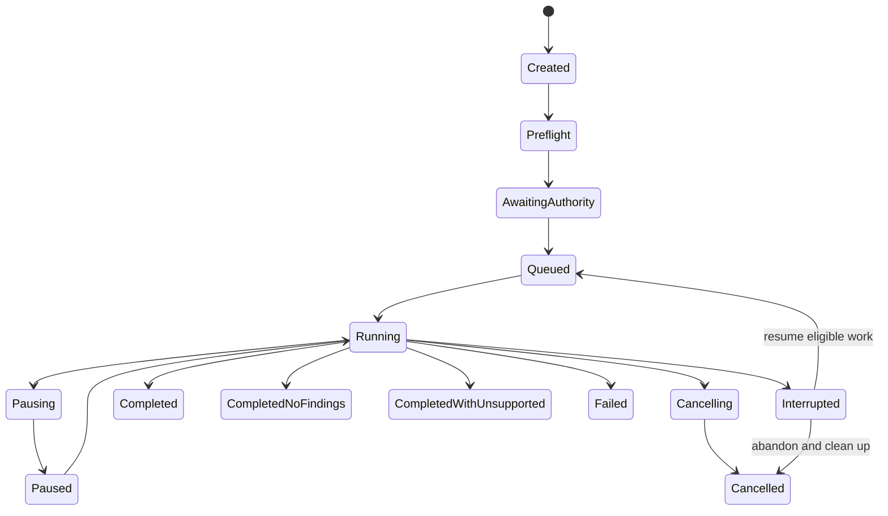

# Contract v2 specification

Status: accepted Phase 0 domain contract
Date: 18 July 2026
Product schema implementation: Phase 2, not Phase 0

## Canonical strategy

Contract v2 will use tracked JSON Schema Draft 2020-12 as the canonical external schema source. Rust, Python, and TypeScript validators/types are generated or mechanically checked from the same schema and verified against shared fixtures. The database is an implementation projection, not a second contract source.

Every external object contains:

```json
{
  "schema_uri": "https://promptectomy.dev/schemas/v2/example.schema.json",
  "schema_version": "2.0.0"
}
```

The public schema base is illustrative until the name/domain is cleared. Checked-in schemas use stable repository-relative `$id` values until then.

Rules:

- JSON is UTF-8 and I-JSON compatible: no duplicate keys, NaN, infinity, invalid Unicode, or integers outside the declared safe representation.
- Timestamps are RFC 3339 UTC with explicit `Z` and declared precision.
- Durations use integer microseconds; byte/token/count fields use non-negative integers. Money uses decimal strings plus currency and price-table version, never binary float.
- IDs and paths are distinct types. User/repository strings never become filesystem paths, branches, database identifiers, or command arguments without validation.
- Ordinary objects set `additionalProperties: false`. Explicit extension objects allow namespaced keys with bounded JSON-safe values.
- Protected content is represented by a typed artifact reference. It never appears inline in safe contracts.
- Digested JSON uses [RFC 8785 JCS](https://www.rfc-editor.org/rfc/rfc8785) over I-JSON, SHA-256, and a domain-separation prefix identifying schema and purpose.

## Identifier types

| Type | Format | Notes |
|---|---|---|
| Repository/run/authority/event/stage/finding/candidate/evaluation/patch/error ID | Type prefix plus lowercase RFC 9562 UUIDv7, for example `run_019f...` | Opaque; generated by trusted core; timestamp ordering is not authorization |
| Snapshot ID | `snap_sha256_<64 lowercase hex>` | Digest of canonical snapshot manifest, not path/tree bytes alone |
| Callsite ID | `cs_sha256_<64 lowercase hex>` | Digest of canonical callsite fingerprint fields |
| Observation ID | Adapter namespace plus stable source identity, or trusted UUIDv7 when none exists | Deduplication key is separate from provider secret/raw payload |
| Artifact ID | `sha256:<64 lowercase hex>` | Bytes digest; class/size/media type live in Artifact entity |
| Receipt ID | `receipt_sha256_<64 lowercase hex>` | Digest of canonical receipt manifest without self field |
| Relative path | UTF-8 repository-relative path under separate validation | No absolute path, NUL, `..`, control characters, or platform escape |

UUIDv7 follows [RFC 9562](https://www.rfc-editor.org/rfc/rfc9562). Exact generation/validation libraries are selected and pinned during implementation.

## Core entities

Fields below are required unless marked optional. Every entity also carries schema fields and its typed ID.

### Repository

- `repository_id`
- `source_kind`: `local`, `https_git`, `ssh_git`, `archive`, `bundle`
- `display_name` as local-only D1 metadata
- `redacted_locator`
- optional `canonical_origin_digest`
- `created_at`

Invariant: repository identity is immutable and never contains credentials. A changed locator creates a new identity or explicit alias record.

### Snapshot

- `snapshot_id`, `repository_id`
- immutable `commit_sha` or `archive_digest`; optional `dirty_diff_digest`
- `tree_digest`, selected roots, exclusions, untracked/submodule/LFS policies
- manifest/lockfile/toolchain inventory
- acquisition and normalization policy digests
- file/object/byte counts and quota outcome
- `created_at`

Invariant: the snapshot manifest is immutable. Any content/policy change creates a new snapshot ID.

### Authority

- `authority_id`, `run_id` or pending action ID
- `mode`: `inspect`, `audit`, `draft`, `apply`, `integrate`
- manifest containing permitted reads, writes, commands, executor, network destinations, environment names, model, budget, egress classes, retention, cancellation, cleanup
- `manifest_digest`, `approved_at`, optional `expires_at`
- approval origin: interactive local user or named noninteractive policy digest
- revocation/cancellation status

Invariant: capabilities can narrow at runtime but widening produces a new authority record. Secret values are prohibited.

### Run and Stage

Run:

- `run_id`, `snapshot_id`, one or more `authority_id` references
- `mode`, `status`, `highest_support_level`
- config/policy/adapter/prompt bundle digests
- safe support summary, counters, budgets, cleanup state
- `created_at`, `started_at`, `terminal_at`, `last_sequence`

Stage:

- `stage_id`, `run_id`, `kind`, `state`
- `attempt`, `max_attempts`, retryability
- optional worker lease owner/heartbeat/deadline
- input/output artifact references and optional `error_id`
- timing and resource summary

Run terminal statuses are `completed`, `completed_no_findings`, `completed_with_unsupported`, `failed`, `cancelled`, and `interrupted`. Stage states are `created`, `awaiting_authority`, `queued`, `running`, `pausing`, `paused`, `cancelling`, `cancelled`, `completed`, `failed`, and `interrupted`.

### Event envelope

```json
{
  "schema_uri": "https://promptectomy.dev/schemas/v2/event.schema.json",
  "schema_version": "2.0.0",
  "event_id": "evt_019f0000-0000-7000-8000-000000000001",
  "run_id": "run_019f0000-0000-7000-8000-000000000001",
  "sequence": 1,
  "occurred_at": "2026-07-18T18:30:00.000000Z",
  "type": "run.created",
  "payload_schema": "https://promptectomy.dev/schemas/v2/events/run-created.schema.json",
  "payload_version": "2.0.0",
  "payload": {
    "mode": "audit",
    "snapshot_id": "snap_sha256_aaaaaaaaaaaaaaaaaaaaaaaaaaaaaaaaaaaaaaaaaaaaaaaaaaaaaaaaaaaaaaaa"
  },
  "artifact_refs": []
}
```

Invariants:

- `sequence` starts at 1 and increases by one per run.
- Event append and projection update are one transaction.
- An event is never rewritten. Sanitized export is a derived artifact.
- Consumers resume after an acknowledged sequence and receive `event_cursor_expired` when retention created a gap.
- At-least-once delivery is deduplicated by `event_id`; idempotent mutations also carry a separate idempotency key.
- Safe payload schemas prohibit D1/D2/D3 bodies and raw exceptions.

### Callsite and Observation

Callsite:

- `callsite_id`, `snapshot_id`
- language/provider/operation/SDK surface and adapter version
- normalized relative path, symbol identity, AST digest, source range
- L0-L5 level, stable/experimental/unsupported state
- discovery evidence, confidence, ambiguity, exclusions/coverage
- optional relocation links with independent confidence/reasons

Observation:

- `observation_id`, `callsite_id`, evidence adapter/version
- provider/model/operation/SDK, timestamp, trace/span/attempt identities
- normalized request/response shape and digests
- protected request/response/tool/retrieval references if authorized
- status, streaming/tool/structured/error/retry/cancel metadata
- duration/usage and price source/version/estimated-or-observed cost
- correlation confidence/reason and capture/redaction policy digests

Invariant: source event retries/duplicates map idempotently. Correlation confidence is never silently upgraded. Protected content remains out of safe events.

### Finding and Candidate

Finding:

- `finding_id`, `run_id`, `callsite_id`
- category, severity/priority, opportunity type, support/evidence grade
- rationale as safe structured facts, uncertainty, required evidence, limitations
- input observation/artifact references and scanner/agent/prompt digests

Candidate:

- `candidate_id`, `finding_id`, `snapshot_id`
- candidate class and target interface
- producer adapter/AgentRuntime/prompt/model/tool versions and digests
- patch/test/dependency artifact references
- state: `proposed`, `unverified`, `evaluating`, `eligible`, `ineligible`, `failed`, `superseded`
- attempt/budget summary and declared nondeterminism

Invariant: a candidate is never eligible without a completed Evaluation that satisfies the policy. Phase 1A output is `unverified`.

### Evaluation

- `evaluation_id`, `candidate_id`
- evaluator manifest and version/digest
- dataset/split/holdout receipts and evidence grade
- executor/runtime image/toolchain/dependency/policy digests
- behavioral, contract/invariant, and domain-truth results, each with coverage and failure distinction
- normalized termination/resource/timing/output summary
- eligible decision plus policy/threshold digest and limitations
- result artifact references and optional `error_id`

Invariant: evaluator failure is not candidate failure or success. Candidate generation cannot read hidden holdout content. Changing any bound input invalidates the evaluation.

### Patch

- `patch_id`, `candidate_id`, base snapshot/commit
- patch media type/digest, affected paths, dependency/config/binary/symlink summary
- apply preconditions, approved checks, destination branch policy
- optional applied commit/diff/recovery reference only in an Apply result entity

Invariant: a patch is data until Apply. It cannot contain an unreported affected path or dependency/config class.

### Artifact

- `artifact_id`, byte count, media type, class: `safe`, `source`, `protected`, `diagnostic`, `executable`
- creation/source entity, policy/retention, encryption envelope metadata where protected
- completeness/quarantine/pinned state and references

Invariant: ID matches bytes. Class cannot be downgraded. Protected/executable artifacts require explicit access checks.

### Receipt

- `receipt_id`, receipt kind/schema/policy version
- snapshot, authority, candidate, patch, evaluator, evidence/split, executor/image/toolchain/dependency, adapter, prompt/model/runtime, command/config, result, and artifact digests as applicable
- evidence grade, support level, limitations, normalized resources/timestamps
- canonicalization and digest algorithms
- trusted-core version and declared nondeterministic fields

The root is SHA-256 over a purpose-prefixed RFC 8785 canonical manifest without `receipt_id`, then encoded as `receipt_sha256_<hex>`. Verification recomputes every referenced digest and policy constraint. V1 has no signer field and is not called signed.

### Error

```json
{
  "schema_uri": "https://promptectomy.dev/schemas/v2/error.schema.json",
  "schema_version": "2.0.0",
  "error_id": "err_019f0000-0000-7000-8000-000000000001",
  "code": "missing_isolation_backend",
  "category": "policy",
  "retryable": false,
  "safe_message": "Verified Draft requires an accepted executor.",
  "next_action": "Configure an accepted OCI backend or run Audit.",
  "stage_id": null,
  "entity_refs": [],
  "diagnostic_artifact_ref": null
}
```

Error categories are `input`, `unsupported`, `policy`, `acquisition`, `adapter`, `agent`, `executor`, `candidate`, `evaluator`, `state`, `storage`, `apply`, `cancel`, and `internal`. Stable codes include all unsupported outcomes from [adapters and support](adapters-and-support.md) plus source/revision/path/quota/auth/schema/version/budget/timeout/crash/tamper/stale/cleanup failures.

## Run state machine



Invalid transitions are rejected. A restart changes abandoned `running` stages to `interrupted` only after lease expiry and worker/process absence are verified. `completed` requires performed-work evidence and no hidden unsupported areas. Cleanup status is orthogonal and visible even after a terminal run state.

## CLI/API compatibility

- Human output can improve without schema versioning. `--json` output, event schemas, API request/response, exit codes, and error codes are stable contracts.
- Noninteractive commands never prompt. Missing authority exits nonzero with a safe error and exact action.
- Mutations require idempotency keys and return the original result for a matching replay; a key reused with different input is rejected.
- HTTP/IPC request bodies, event payloads, arrays, strings, recursion, and artifact responses are size-bounded.
- Unknown major versions are rejected. A reader accepts newer minor data only where schema/compatibility fixtures prove the additive behavior.

Proposed CLI exit classes:

| Code | Meaning |
|---:|---|
| 0 | Requested supported work completed, including explicit `completed_no_findings` |
| 2 | Invalid input or contract |
| 3 | Unsupported/insufficient evidence prevented requested work |
| 4 | Policy/authority denial |
| 5 | Acquisition/adapter/toolchain failure |
| 6 | Agent failure/budget exhaustion |
| 7 | Executor/candidate/evaluator failure |
| 8 | Cancelled or interrupted |
| 9 | State/storage/integrity/internal failure |

`completed_with_unsupported` exits 3 when unsupported work was part of the requested outcome, and 0 only for commands explicitly requesting best-effort inventory with machine-visible unsupported details.

## Schema generation and compatibility

Phase 2 creates:

```text
schemas/v2/
  common/
  entities/
  events/
  api/
  examples/
generated/
  rust/
  python/
  typescript/
```

Generation is pinned and reproducible. CI validates schemas against the declared meta-schema, regenerates bindings, requires a clean diff, compiles/checks all three languages, validates shared positive/negative examples, and exercises previous-minor/unknown-major fixtures. Schema and generator digests enter release provenance.

## Disposable Phase 0 proof

The proof is deliberately outside the repository product tree and does not create a Rust workspace. It validates representative Repository, Run, Event, Error, and Receipt examples plus negative fixtures for unknown fields, unsafe IDs, invalid sequences/status, and malformed digests using one Draft 2020-12 schema bundle from:

- Rust with a pinned JSON Schema validator;
- Python with a pinned JSON Schema validator;
- TypeScript/JavaScript with a pinned JSON Schema validator.

The retained Phase 0 evidence is the temporary path, tool/runtime versions, schema/example SHA-256 digests, commands, positive/negative counts, and results. Temporary code is not a product deliverable.

Proof status: passed on 18 July 2026.

| Validator | Runtime | Result |
|---|---|---|
| `jsonschema` 0.48.1 | Rust 1.92.0 | 5 positive accepted; 5 negative rejected |
| `jsonschema` 4.26.0 | Python 3.12.8 via `uv` 0.11.26 | 5 positive accepted; 5 negative rejected |
| Ajv 8.20.0 | Bun 1.3.10 / TypeScript | 5 positive accepted; 5 negative rejected |

Evidence:

- disposable root: `/tmp/promptectomy-contract-proof.xgXnx0`;
- schema SHA-256: `931deaaaf7f12dc004abb06091456cc4ddbee4828f56c580ec85e33c4c6599b7`;
- positive fixture SHA-256: `bffe876b7d04f2b90313c717a83fbf2391182cb67161650eb6e30606e028a978`;
- negative fixture SHA-256: `84a75414f5d97fafeb00aa194246759a0385f080af544e8fcbc69cda3cc7f216`;
- Rust lockfile SHA-256: `ef0e4ce44a0d8099bdfc0d59eae68822efbb7fd6197164613e4974a401d30839`;
- Bun lockfile SHA-256: `ac0bad9c3731f30c3c1bf0ede1c2769e078f8933b423772679dcf13717247569`.

Successful commands, run only under that disposable root:

```text
uv run --with 'jsonschema==4.26.0' python python/proof.py
cd typescript && bun install --ignore-scripts && bun run proof.ts
cd rust && cargo generate-lockfile && cargo run --locked
```

The negative cases proved closed rejection for an unknown field, a path-traversal-shaped identifier, sequence zero, an unknown run status, and a malformed receipt digest. This is evidence that the cross-language Draft 2020-12 approach is viable, not that the representative schema is the final product contract. No proof file, dependency, workspace, or generated binding was added to the product repository.

## Deferred decisions

- Exact schema generator libraries and checked-in generated layout are selected in Phase 2 after the proof and dependency/license review.
- Protobuf/binary streaming is deferred until measured need.
- Third-party signed evaluation receipts are deferred until signer/key/verification policy exists.
- Public schema domain is deferred until name/domain clearance.

## Verification

Contract tests are `CONTRACT-*`, state tests `STATE-*`, receipt tests `RECEIPT-*`, and compatibility tests `COMPAT-*` in [testing and benchmarks](testing-and-benchmarks.md). Security/privacy constraints are in [the threat model](threat-model.md) and [privacy policy](privacy-and-data-egress.md).
