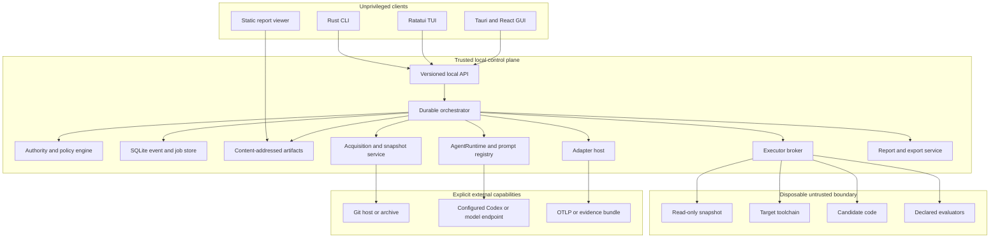
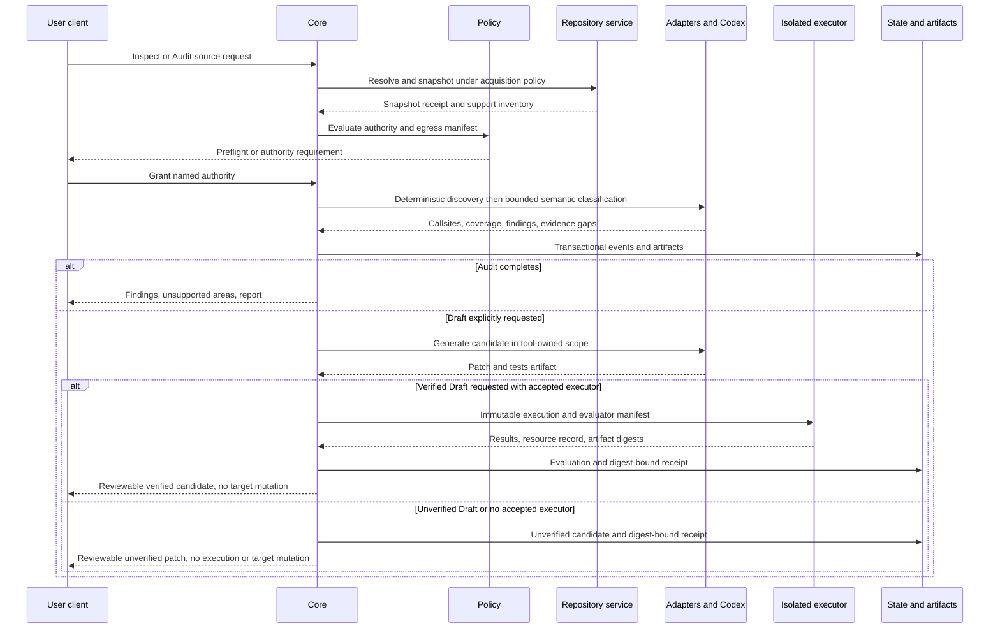

# PROMPTECTOMY system design

Status: accepted Phase 0 target architecture
Date: 18 July 2026
Current implementation remains the hackathon prototype at `8bab7bb`

## Recommendation

Build one local trusted control plane with replaceable language, provider, evidence, agent, and executor adapters. CLI, TUI, desktop GUI, and static reports consume the same versioned run model. Analysis is read-only, candidate work stays in tool-owned storage, untrusted execution is isolated, and Apply is a separate branch-based operation.

The load-bearing tradeoff is stricter capability and evidence gates in exchange for honest, recoverable behavior. PROMPTECTOMY should return unsupported or unverified rather than fall back to host execution or target mutation.

## Current-to-target seam

The Python prototype is evidence for domain behavior, not the target authority:

| Prototype behavior | Target replacement | Migration rule |
|---|---|---|
| Typer command owns orchestration | Rust orchestration/policy core | Safe Python reference path first, then wrap through versioned adapter |
| Mutable JSONL/registry state | SQLite events/projections plus content-addressed artifacts | Import originals without rewriting; mark missing provenance |
| Worktree/branches inside target | Immutable snapshot and scratch in tool-owned storage | Source digest must remain unchanged |
| Generated Python imported in parent | Executor interface with offline isolated worker | No compatibility fallback to parent import |
| Pydantic/Zod manual mirror | Canonical contract v2 with generated validators/bindings | Conformance fixtures before retiring v1 readers |
| Sync OpenAI shim | Python/Node provider capture adapters | Stable matrix requires sync/async/stream/tools/errors/retries |
| Recorded replay stage UI | Run-first TUI/GUI/report clients | Historical fixture remains clearly labelled demo mode |
| Codex CLI called directly | Provider-neutral `AgentRuntime` | Record prompt/runtime/model/budget and separate connector credentials from tools |

## Component model



## Ownership and interfaces

| Component | Owns | Inputs and outputs | Failure behavior | Trust zone |
|---|---|---|---|---|
| Local API | Authentication, idempotency, cursors, safe response shapes | Contract v2 requests/events/artifact references | Typed error, never implicit retry or success | Trusted core boundary |
| Orchestrator | Run/stage state, leases, retries, cancellation, recovery | Authority plus manifests to jobs; transactional events out | Unknown work becomes interrupted, never completed | Trusted core |
| Policy engine | Capability evaluation and authority records | Requested action plus source/runtime/data context; allow/deny/needs-authority | Deny by default with reason and exact next action | Trusted core |
| Event/job store | Runs, stages, events, projections, leases, migrations | Transactional append/projection/read | Busy/recovery/migration errors remain typed; no partial success | Trusted core/private storage |
| Artifact store | Immutable blobs, digests, references, pins, retention, deletion | Bytes plus class/policy; digest reference and metadata | Quarantine incomplete/tampered artifacts | Trusted core/private and protected classes |
| Acquisition service | Local/Git/archive input, immutable snapshots | Source request plus Git policy; snapshot and receipt | Cleanup plus typed protocol/path/quota error | Networked trusted helper, hostile input |
| Adapter host | Discovery, provider/evidence normalization, target-language mapping | Snapshot/evidence plus adapter manifest; typed findings/observations | Unsupported/ambiguous coverage is returned, not dropped | Trusted broker plus isolated adapter process |
| AgentRuntime | Typed bounded semantic tasks and normalized activity | Minimized context, prompt bundle, schema, budgets; artifact proposal | Invalid schema/budget/attempt exhaustion is terminal for invocation | Trusted model connector, hostile context |
| Executor broker | Backend selection, manifest enforcement, process/resource control | Immutable execution manifest; sanitized result/artifacts | Fail closed when requested controls are unavailable | Trusted broker to untrusted worker |
| Export service | Frozen run projection to JSON/Markdown/HTML/NDJSON/SARIF/JUnit/patch/receipt | Run snapshot plus export policy | Redaction/sanitization failure blocks export | Trusted core, untrusted output consumer |
| CLI/TUI/GUI | User intent, presentation, local cancellation | Local API only | Reconnect and show authoritative core state | Unprivileged clients |
| Static report | Sanitized, non-privileged review | Frozen export only | No dynamic privileged bridge | Untrusted viewing context |

Core interfaces are versioned protocol boundaries, not in-process plugin traits exposed to untrusted code:

- `RepositorySource -> SnapshotReceipt`
- `DiscoveryAdapter(snapshot, policy) -> Coverage + Callsite[]`
- `EvidenceAdapter(bundle, policy) -> Observation[] + Coverage`
- `ProviderAdapter(operation evidence) -> NormalizedSemantics`
- `AgentRuntime(task manifest) -> AgentResult + ArtifactRef[]`
- `Executor(execution manifest) -> ExecutionResult + ArtifactRef[]`
- `Evaluator(candidate, dataset, manifest) -> Evaluation`
- `Exporter(run snapshot, export policy) -> ArtifactRef`

Every response includes adapter/protocol version and safe diagnostics. Adapter processes do not receive the database handle, artifact root, user home, or model credentials.

## End-to-end flow



Ordering rules:

1. Resolve source and support before requesting expensive/model authority.
2. Deterministic inventory/discovery precedes Codex classification.
3. Source/trace/model egress is separately granted from local reading.
4. Candidate generation never sees the hidden holdout.
5. Parent-controlled evaluators, not the agent, determine eligibility.
6. Apply is not a continuation of this run. It re-resolves source, validates the receipt/snapshot, and requests new authority.

## State and data model

The canonical entities and state machine are in [contract v2](contracts-v2.md). Operationally:

- SQLite uses a single logical writer owned by the orchestrator and bounded read transactions for clients.
- A state transition and its event append are one transaction.
- Events are append-only with run-local sequence and global event ID.
- Workers use leases with owner, heartbeat, deadline, and attempt. Recovery verifies worker absence before marking interrupted.
- Artifacts are immutable; mutable labels/pins are database references.
- Protected content is separate encrypted blob storage. Safe events contain only opaque references and safe summaries.
- A frozen run snapshot drives all exports so formats cannot observe different live moments.

SQLite WAL is local-host only and the embedded version must contain the upstream 2026 WAL-reset fix. The [SQLite WAL documentation](https://sqlite.org/wal.html) is authoritative for same-host, checkpoint, concurrency, backup, and fixed-version constraints.

## Local API

Representative v1 surface:

```text
POST   /v1/repositories/inspect
POST   /v1/runs
GET    /v1/runs/{run_id}
POST   /v1/runs/{run_id}/authority
POST   /v1/runs/{run_id}/cancel
POST   /v1/runs/{run_id}/resume
GET    /v1/runs/{run_id}/events?after={sequence}
GET    /v1/runs/{run_id}/callsites
GET    /v1/findings/{finding_id}
GET    /v1/candidates/{candidate_id}
POST   /v1/candidates/{candidate_id}/evaluate
POST   /v1/candidates/{candidate_id}/apply
POST   /v1/runs/{run_id}/exports
GET    /v1/artifacts/{algorithm}/{digest}
```

Mutations require idempotency keys. Long work returns a run/job identity. Event cursors detect gaps. Artifact reads enforce class/authority and never accept filesystem paths. Errors use the taxonomy in [contract v2](contracts-v2.md).

Transport preference is Unix domain socket or Windows named pipe protected by OS permissions. Loopback HTTP is a fallback with a short-lived capability token, loopback-only bind, strict Origin/Host checks, no wildcard CORS, bounded request bodies, and lifecycle tied to the core. Tauri invokes narrow commands through explicit capabilities; it receives no arbitrary shell or filesystem bridge.

## Repository, evidence, and identity

Acquisition follows [ADR 0004](../adr/0004-git-acquisition.md). Every snapshot records origin/local identity, immutable commit or dirty-tree digest, selected roots, path exclusions, submodule/LFS policy, manifests/lockfiles/toolchains, tree digest, acquisition policy, and adapter versions.

A callsite fingerprint includes repository identity, snapshot digest, normalized repository-relative path, enclosing symbol, provider operation, normalized AST subtree digest, and adapter version. Cross-commit relocation is a separate match with confidence, never an identity rewrite.

Evidence adapters ingest OTLP and OpenInference-compatible spans/bundles, tolerate duplicate and out-of-order delivery, and attach observations only when the correlation rule and confidence are reported. The [OTLP specification](https://opentelemetry.io/docs/specs/otlp/) explicitly permits retries that can produce duplicates, so ingestion is idempotent by normalized event identity.

## Agent and execution boundaries

The trusted model connector can reach only the configured Codex/model endpoint. It holds authentication outside agent tool environments. Repository tools and generated/test code remain offline in the executor. An AgentRuntime that cannot enforce that split is unsupported for Draft.

The [Codex SDK](https://developers.openai.com/codex/sdk) supports programmatic local threads, and the CLI exposes machine-readable noninteractive execution and an output schema. PROMPTECTOMY normalizes those surfaces rather than making Codex session/event types its database schema.

For Phase 1A only, the accepted connector is deliberately non-agentic: the trusted Python process calls an API-available Codex coding model through OpenAI Responses with no tools, strict structured output, and only manifest-approved source slices serialized into the request. `codex exec` and Codex SDK threads are prohibited on the general Phase 1A Draft path because the current prototype's workspace-write shell boundary does not satisfy this design. Missing API/model/schema/egress/budget capability produces a typed `safe_agent_transport_unavailable` outcome and no patch. Agentic Codex integration is reconsidered only with an accepted executor and `CONNECTOR-*`/`AGENT-*` evidence.

Executor tiers and acceptance are defined in [ADR 0006](../adr/0006-executors-and-agent-authority.md). The core never retries through a weaker backend.

## Reliability and failure handling

| Failure | Required state | Recovery/degradation |
|---|---|---|
| Unsupported language/provider/call pattern | `completed_with_unsupported` if supported work is trustworthy | Show coverage and adapter needed |
| Missing isolation | Policy denial/typed unsupported for verified Draft | Audit and policy-permitted unverified patch remain available |
| Agent unavailable/schema invalid/budget exhausted | Named agent failure, bounded attempts | Preserve deterministic findings and diagnostics |
| Candidate compile/test failure | Candidate/evaluation failure, not run success | Preserve patch and sanitized logs for review |
| Evaluator failure | Distinct evaluator failure | Never score candidate as failed/passed from missing evaluator |
| Core/daemon crash | Running work becomes interrupted only after lease/worker check | Resume eligible stages or abandon with cleanup |
| Disk full/corrupt artifact | Failed/interrupted with quarantined artifact | Do not emit receipt or completed event |
| Event gap/client disconnect | Client reconnects after cursor or receives retention-gap error | Core state remains authoritative |
| Cancel | Cancelling then cancelled after process-tree verification | Record unkillable/orphan condition as failure |
| Source changes before Apply | Stale snapshot refusal | New Audit/Draft required; no implicit rebase |

Retries are cause-specific, capped, idempotent, and evented. Cleanup is independently retryable and cannot delete user paths or pinned artifacts.

## Performance and scaling assumptions

The stable local product targets one OS user and one machine. SQLite has one orchestrator writer; this is a deliberate local boundary, not a team-service design.

Hot paths and controls:

- inventory/discovery stream files and cache by snapshot/file/adapter digest;
- source hashing is incremental and bounded-memory;
- observation import is batched, deduplicated, and backpressured;
- model context is assembled from minimal symbol slices after deterministic discovery;
- executor concurrency is bounded by CPU, memory, runtime, and user budget;
- logs/events/artifacts have per-item and per-run caps;
- clients subscribe from a sequence and virtualize large collections;
- SQLite read transactions are short and WAL checkpoints are observed and bounded.

Actual release thresholds are established by [testing and benchmarks](testing-and-benchmarks.md). Design budgets are not product promises.

## Migration sequence and rollback

| Phase | Outcome | Must be true before next phase |
|---|---|---|
| 0 | Decisions, threats, contracts, tests, handoff | No unresolved P0/P1; no product code change |
| 1A | Honest non-mutating Python command semantics and unverified patch artifacts | Source digests unchanged; no generated parent import; typed zero-work/unsupported |
| 1B | Accepted isolated executor | Verified Draft fails closed without backend; hostile resource/secret/network tests |
| 1C | Installed-wheel and hostile acceptance | Full fixture/privacy corpus passes outside checkout |
| 2 | Contract v2, durable state/artifacts, real local reports | One run produces equivalent safe projections and crash recovery |
| 3 | Rust core/CLI around adapters | Conformance, cancellation, recovery, and cross-platform CI |
| 4 | Stable Python/TypeScript discovery/evidence | Declared Responses/OTLP matrix and privacy gates pass |
| 5 | Isolated synthesis/evaluation | Python and TypeScript L4 fixtures and receipt integrity pass |
| 6-8 | TUI, GUI, bounded agent office, safe Apply | Client parity, accessibility, Tauri, agent, and Apply security gates |
| 9 | Open-source release candidate | Governance, installers, SBOM, signing/provenance, external review |
| 10 | Optional CI/hosted/shadow/language lanes | Separate designs and authority grants |

Rollback is versioned, never a hidden flag. Legacy formats remain import-only. Database migrations take verified backups. Adapters can pin a compatible protocol. A failed executor disables verified Draft rather than host-fallback. Applied patches always have a base, branch, diff, and recovery reference.

## Rejected system shapes

- One Python process for CLI, agent, generated code, verifier, server, and shim.
- Browser/Tauri/Electron presentation code as orchestration authority.
- Direct target-repository worktrees for Draft.
- Hosted multi-tenant execution before the local security model is proven.
- Universal WASM or universal container assumptions.
- Kafka/Postgres/Kubernetes/Temporal for local v1.
- Big-bang Rust rewrite.

## Decision dependencies

- Product promise: [vision and scope](../product/vision-and-scope.md)
- Authority: [ADR 0001](../adr/0001-authority-and-non-mutation.md)
- Support: [adapters and support](adapters-and-support.md)
- Data/receipts: [ADR 0005](../adr/0005-state-artifacts-and-receipts.md)
- Security: [threat model](threat-model.md)
- Privacy: [privacy and data egress](privacy-and-data-egress.md)
- UX: [UX contracts](ux-contracts.md)
- Verification: [testing and benchmarks](testing-and-benchmarks.md)
