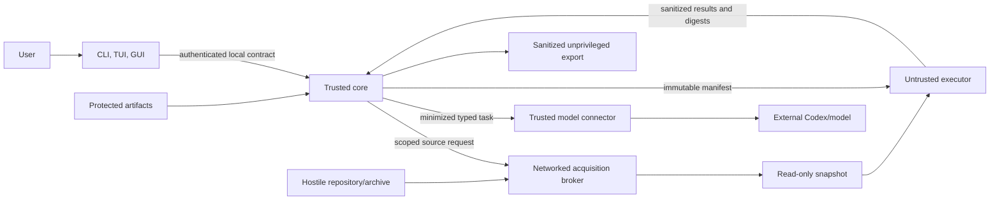

# PROMPTECTOMY threat model

Status: accepted Phase 0 design, implementation controls not yet certified
Date: 18 July 2026
Scope: local single-user product through safe Apply; hosted/multi-tenant and runtime shadowing require separate threat models

## Security posture

The hackathon prototype is no-go for untrusted repositories, real/private traffic, generated-code activation, and production workloads because it writes inside the target checkout, imports generated Python into the parent process, uses a bypassable AST policy as a control, and over-inherits environment state.

The target design is acceptable only when the controls below are implemented and their mapped tests pass. A design decision is not runtime certification.

## Assets

- target repository contents, history, dirty/untracked state, Git config, and developer work;
- prompts, completions, tools, retrieved content, traces, labels, and correlation identifiers;
- credentials, OS keychain material, SSH agent, Git broker, model/provider tokens, cloud/database URLs;
- hidden holdouts, evaluator policy, domain labels, and acceptance thresholds;
- generated candidates, patches, tests, reports, events, receipts, and source snapshots;
- core database/artifact store, signing/update/release identity, and local API capabilities;
- host filesystem, processes, network, CPU/memory/disk/PIDs, terminal, clipboard/browser, and user trust.

## Actors and assumptions

Threat actors include a malicious repository/archive author, malicious contributor/dependency, prompt injection embedded anywhere in source/evidence/tool output, compromised adapter/toolchain/model output, untrusted local website/process, another local OS user, tampered local artifact/state, and compromised release/update channel.

Assumptions:

- the host OS and current user's account are trusted for local v1;
- other OS users are not trusted and cannot read private state under correct permissions;
- Codex/model services are external processors governed by the approved egress policy, not part of the local trusted computing base;
- OCI/Wasmtime/runtime software may contain vulnerabilities, so backend/version and hostile acceptance are recorded rather than described as perfect isolation;
- the target repository and all its text, paths, metadata, config, build behavior, dependencies, and output are hostile;
- a local root/administrator compromise is out of scope for data confidentiality, but integrity failures must still be detectable where practical;
- hosted execution, organizations/roles, billing, data residency, and runtime deployment are out of scope.

## Trust zones

Only the core owns authority/state decisions. Acquisition and model connector are narrow trusted helpers with separate credentials and endpoints. The executor is untrusted. Clients and reports have no arbitrary filesystem/shell bridge.

## Security invariants

| ID | Invariant |
|---|---|
| SEC-01 | Inspect, Audit, and Draft do not modify target files, index, refs, config, hooks, worktrees, or untracked set |
| SEC-02 | Repository/generated code never executes in the core or client process |
| SEC-03 | Verified Draft fails closed without an accepted executor; no host fallback |
| SEC-04 | Executor and agent tools receive no undeclared environment, credentials, host sockets, or network |
| SEC-05 | Model/Git/provider credentials remain confined to their trusted connector/broker |
| SEC-06 | Repository/evidence text is untrusted data and cannot grant authority, tools, egress, budget, holdout, Apply, or Integrate access |
| SEC-07 | Source/trace/model egress matches an approved manifest digest and stops on expansion |
| SEC-08 | Protected content never enters safe events/logs/API/exports/analytics by default |
| SEC-09 | Paths, IDs, archives, Git objects, artifacts, and symlinks remain within declared roots and quotas |
| SEC-10 | Cancellation terminates the full worker/agent process tree and revokes capabilities |
| SEC-11 | State transitions, artifacts, patches, evaluations, and receipts are integrity-checked and cannot produce false completed status after crash/tamper |
| SEC-12 | Apply validates snapshot and receipt, targets a named non-default branch, previews the full diff, and creates a recovery reference |
| SEC-13 | Local API/Tauri/report surfaces expose only scoped operations and sanitized data to allowed origins/windows |
| SEC-14 | Every supported/release claim is backed by the matching acceptance evidence and has no unresolved critical/high finding |

## Threats, controls, and tests

| Threat ID | Threat and impact | Required controls | Verification IDs |
|---|---|---|---|
| GIT-01 | Scheme/remote helper/config causes command execution or unexpected source | Explicit HTTPS/SSH only, neutral config, protocol deny-by-default, fixed local config, no external helpers/bundle URI | GIT-01..05 |
| GIT-02 | Credential-bearing URL/helper/SSH config leaks credentials | Reject userinfo/query secrets, one reviewed broker, no inherited helper, strict SSH, redacted origin | GIT-06..10, CRED-01 |
| GIT-03 | Submodule/LFS/filter expands network/code/resource scope | Disabled by default; each submodule/LFS acquisition separately consented; no filters/smudge | GIT-11..17 |
| PATH-01 | Traversal, symlink/hardlink, device, case collision, archive bomb escapes storage | Normalize before create, root confinement, duplicate/case/device rules, quotas, non-executing parser | PATH-01..10, ARCH-01..08 |
| EXEC-01 | Generated/repository code escapes and steals/changes host data | Accepted OCI/WASI backend, read-only mounts, no host sockets/devices, non-root, syscall/capability policy, no parent import | EXEC-01..12 |
| EXEC-02 | Fork/memory/CPU/disk/output/time bomb denies service | CPU/memory/PID/file/disk/time/output limits, bounded concurrency, process-group kill, post-cancel check | EXEC-13..22, CANCEL-01..05 |
| EXEC-03 | Dependency/build scripts execute during acquisition or online | Separate dependency phase, isolated network allowlist, lockfile/integrity/script policy, offline evaluation | EXEC-23..28, SUPPLY-01 |
| CRED-01 | Agent/executor receives model/Git/cloud/provider secrets | Empty child environment, no credential mounts/sockets, connector/tool separation, canary suite | CRED-01..09 |
| AGENT-01 | Repository prompt injection widens tools, exfiltrates data, or changes objective | Untrusted delimiters, minimal context, typed output, fixed tools/budgets, deterministic validation, no authority in agent | AGENT-01..12 |
| AGENT-02 | Agent loops indefinitely or hides failure | Attempt/time/token/spend/output caps, reason-coded terminal state, parent cancellation | AGENT-13..18 |
| HOLD-01 | Candidate/agent learns hidden holdout or reversible group keys | Separate vault/role, opaque dataset handles, executor mounts only at evaluation, receipt audit | HOLD-01..08 |
| EVAL-01 | Baseline agreement preserves a wrong model result or leakage inflates score | Behavioral/contract/domain lenses, grouped/temporal splits, evidence grades, minimum samples, leakage tests | EVAL-01..14 |
| EGRESS-01 | Source/trace leaves machine without informed consent | Manifest digest, preview, minimization/redaction, destination/budget limits, re-consent on expansion, local-only mode | EGRESS-01..12 |
| PRIV-01 | Protected content leaks via events, errors, reports, API, analytics, or diagnostics | Separate encrypted blobs, safe schemas, double redaction, canary corpus, previewed exports | PRIV-01..18, REPORT-01..08 |
| BACKUP-01 | Copied store/backup/key loss exposes or destroys protected data | OS-keystore wrapping key, authenticated envelope, key/tamper/backup/restore tests, fail closed | BACKUP-01..10 |
| API-01 | Website/local process controls daemon or reads artifacts | UDS/named pipe permissions, short-lived TCP capability, Host/Origin checks, loopback, no wildcard CORS, body/rate limits | API-01..12 |
| GUI-01 | Remote/report content invokes privileged Tauri commands | Bundled local UI, explicit minimal capabilities, no wildcard shell/fs/network, origin/window scoping, no remote privileged content | GUI-01..10 |
| REPORT-01 | XSS/URL/SVG/Markdown/terminal content attacks viewer | Contextual escaping, CSP, safe URL schemes, no privileged bridge/scripts, ANSI/bidi sanitization | REPORT-01..12, TUI-SEC-01..06 |
| STATE-01 | Crash/stale lease/event gap/database corruption produces false completion | Transactional event+projection, leases, interrupted recovery, checksums, backup/migration/disk-full tests, patched SQLite | STATE-01..16 |
| ART-01 | Artifact replacement, path swap, or partial write invalidates result | Content digest, atomic write, root confinement, quarantine, recheck before use, class/size metadata | ART-01..12 |
| RECEIPT-01 | Tampered or stale patch/evaluation is accepted | Bind snapshot/candidate/evaluator/policy/tool/artifact digests, canonical verification, Apply revalidation | RECEIPT-01..10, APPLY-01..12 |
| APPLY-01 | Apply overwrites user work/default branch or races target change | Explicit command/branch, clean/ack policy, snapshot match, preview, recovery ref, no force, isolated checks | APPLY-01..16, INV-NM-01..05 |
| SUPPLY-01 | Compromised dependency, adapter, installer, prompt, model/runtime, or update | Lock/pin/digest, license/vuln scan, SBOM, clean CI, signed release/provenance, prompt digest/regression, update verification | SUPPLY-01..16 |
| ADAPTER-01 | Malicious/buggy adapter reads storage/secrets or lies about coverage | Out-of-process scoped protocol, no core paths/DB/credentials, conformance/coverage contract, binary digest | ADAPTER-01..10, SUP-01..12 |
| DOS-01 | Huge repo/trace/event/import exhausts trusted core | Streaming parsers, byte/count/depth/time caps, backpressure, bounded allocation/concurrency, quotas | DOS-01..12, PERF-01..08 |
| MULTIUSER-01 | Another local user reads state/socket/artifacts | Private directory/socket permissions, owner checks, no shared temp names, protected blobs | MULTIUSER-01..06 |
| UPDATE-01 | Silent remote prompt/config/model/update changes reproducibility/authority | Versioned local prompt/config assets, no remote hidden flags, explicit update, digest in receipt | UPDATE-01..08 |

## Design abuse cases

Required hostile fixtures include:

- source/docs/tests/filenames that instruct Codex to read secrets, network, change policy, reveal holdout, or Apply;
- `.gitmodules`, `.gitattributes`, Git/SSH/helper/filter/LFS configurations that attempt command execution or cross-host fetch;
- archives with traversal, symlink/hardlink escape, devices, duplicates, Unicode/case conflicts, huge expansion, and nested archives;
- code that probes environment/files/network/sockets, forks/grandchildren, loops, allocates/fills disk, floods output, emits ANSI/OSC8/bidi, or kills parent;
- generated patches that add dependencies, workflows, hooks, binaries, symlinks, ignored files, or out-of-scope paths;
- traces containing credentials, personal data, malicious HTML/Markdown/SVG/URLs, prompt injection, malformed protobuf/JSON, duplicates, partial batches, and huge fields;
- tampered candidate/evaluator/policy/toolchain/receipt/artifact bytes and a changed source between evaluation and Apply;
- daemon/adapter/executor/client crashes and disk-full at every state edge.

## Release gates

The following block the relevant support claim or release:

1. Any target mutation in Inspect, Audit, or Draft.
2. Any parent/client-process execution of repository/generated code.
3. Any executor path to host secrets, undeclared files/sockets, or unrestricted network.
4. Any agent ability to widen authority, access holdout, or bypass deterministic evaluation.
5. Any protected canary in safe events/logs/API/exports/analytics/diagnostics.
6. Any false completed/zero-work state, unbounded loop, or orphan process.
7. Any local API/Tauri/report privileged access from an unapproved origin/content source.
8. Any stale/unbound receipt accepted by Apply or target default-branch/user-work damage.
9. Any unresolved critical/high security finding relevant to the claimed mode/platform.
10. Any README/UI claim beyond the automated and manual acceptance matrix.

Remote/private Git, protected capture, verified Draft, Apply, desktop packaging, and public release each stay disabled until their own mapped gates pass.

## Residual risk and deferred designs

- Local administrator/root compromise can bypass local protections.
- External model/provider confidentiality and retention depend on the selected service agreement and approved policy.
- Containers/WASI/microVMs reduce risk but can have vulnerabilities; supported versions/backends are pinned and reviewed.
- Human domain labels/evaluators can be wrong; evidence grades expose rather than eliminate this risk.
- Git hosts and package registries can serve malicious bytes within protocol rules; digest/policy/isolation and review remain necessary.
- Hosted multi-tenancy, CI pull-request tokens, runtime shadowing, remote collaboration, automatic updates, and signing-key operations require separate Phase 10/release threat models.

## Review requirements

Security review is mandatory before Phase 1A merge and at Phase 1B executor, Phase 1C hostile acceptance, Phase 3 local API, Phase 4 protected capture, Phase 5 evaluation, Phase 7 Tauri, Phase 8 Apply/agents, and Phase 9 release exits. A finding is closed only by a changed decision/control plus test evidence or an explicitly accepted lower-severity risk with owner and phase. Critical/high risks cannot be accepted for a stable claim.
